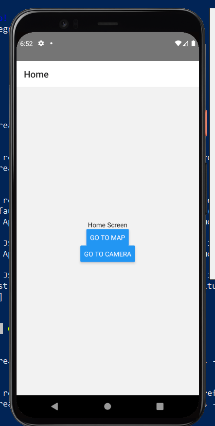
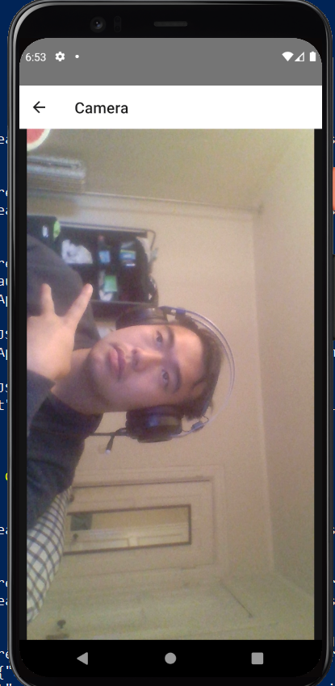
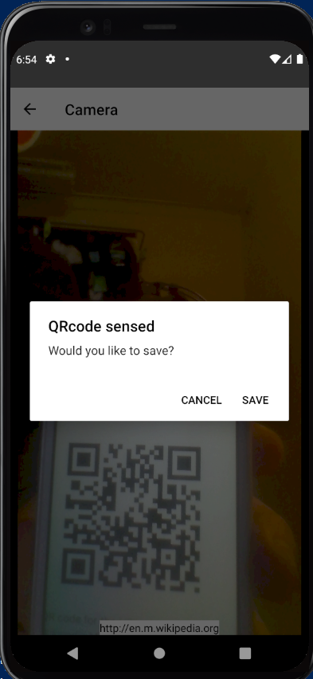
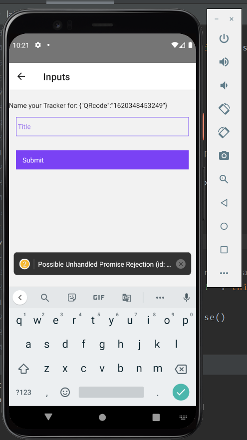

# EC500-Final-Barcode-Analyzer
React Native App that analyzes a camera feed for barcodes and more.

## Overview
The purpose of this application is to scan product barcodes and help the user remember where they found them on the map. In addition, the privacy of the user and any of the people included in the picture will be protected.

## MVP + User Stories
### MVP
- Camera module with capability to saves images and detect faces and barcodes.
- Map module capable of showing Geo-tags of saved barcodes/products
- Mobile + WEB application interfaces

### User Stories
- As a user, I want to be able to scan barcodes and save the location of where the photo was taken.
- As a user, I want to have my privacy and identity protected. This includes picture metadata such as location and the faces of others in the images taken to be obfuscated. 
- As a user, I want to be able to edit my saved barcodes. This means I can rate, delete, favorite my saved barcodes.
 
## Design

### Home Screen
The home screen allows the user to either view their past markers on the map or create new markers by finding QR codes on the camera

### Camera Screen
The Camera screen automatically detects QRcodes in the view. Upon detection, the user will be prompted to either ignore or save the QR code.

 

### New Tracker Screen
This screen is only accessable upon QR code detection. The user is prompted for a name for the tracker as well as any other information the user wants to include.

### Map Screen
The Map screen does a database call to print all the past markers on the map. Clicking on each marker also shows the user what they input

### Backend/Persistence
All persistence is done with Firebase Realtime Database and an interfacing package called "react-native-firebase". For example, when the user opens the map screen, the backend includes a call to Firebase to query for all existing trackers. When the user wants to save a new tracker, a data push is called and upon saving, a new entry with all the metadata and user input data is saved in Firebase.

## Next Steps
Due to limited time and resources, there was not enough time to fully flesh out the complete product.

Features we were going to add:

- Add ability for removal and update of trackers from Map screen (Currently only have Create and Read)
- Port code to be a WEB application as well
